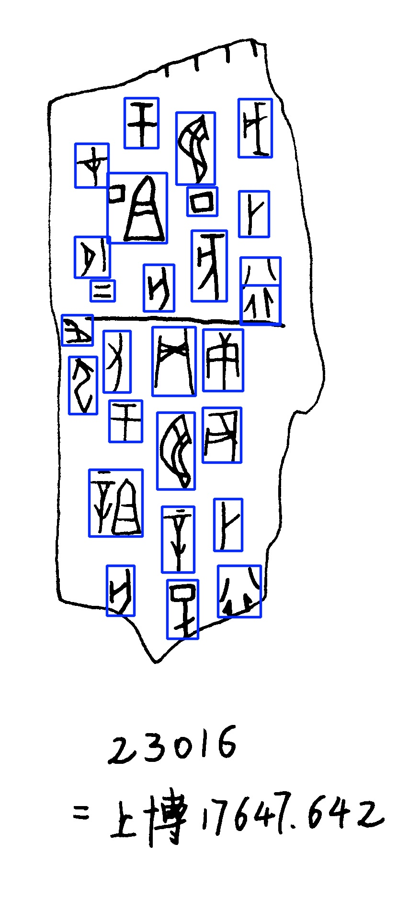
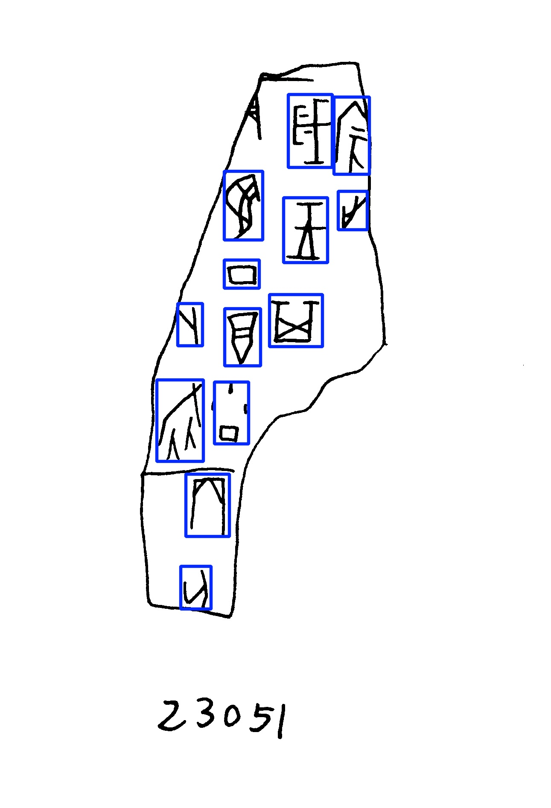
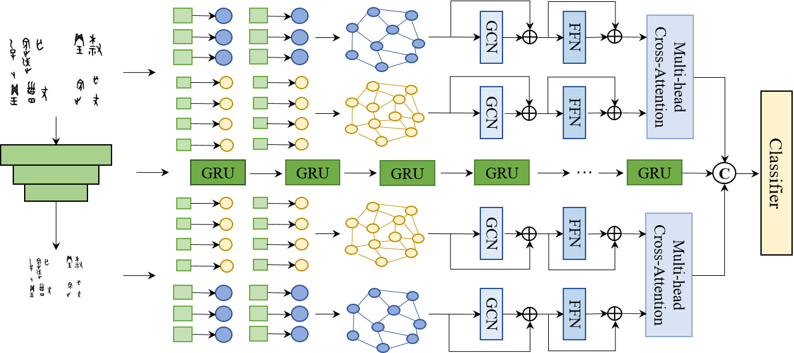
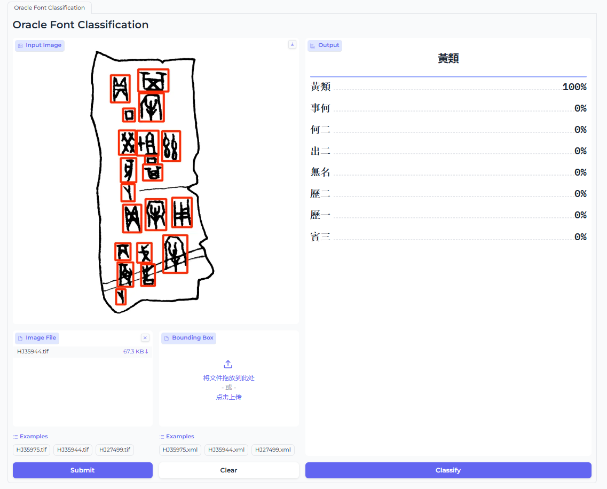

# R-GNN: recurrent graph neural networks for font classification of oracle bone inscriptions

## [Published in Heritage Science](https://heritagesciencejournal.springeropen.com/articles/10.1186/s40494-024-01133-4)

## 1.甲骨文字检测

临摹甲骨文图像质量较高，检测任务较为简单，检测模型采用YOLOv8进行

### 1.1 数据集

1. voc数据集转yolo数据集脚本：E:\毕业设计实验\oracle-font-recog\det_yolo\ultralytics\dataset\xml2txt.py
2. 数据集划分脚本：E:\毕业设计实验\oracle-font-recog\det_yolo\ultralytics\dataset\split_data.py
3. 数据集配置：E:\毕业设计实验\oracle-font-recog\det_yolo\ultralytics\dataset\data.yaml

### 1.2 模型训练

1. 训练参数配置：E:\毕业设计实验\oracle-font-recog\det_yolo\ultralytics\ultralytics\cfg\expriment.yaml

2. 模型训练：

   ```python
   model = YOLO('yolov8n.pt')
   ## cfg:训练参数配置文件 data:数据集配置文件
   model.train(**{'cfg':'ultralytics/cfg/expriment.yaml', 'data':'dataset/data.yaml'})
   ```

3. 模型推理：

   ```python
   model = YOLO('./runs/detect/train4/weights/best.onnx')
   # source: 文件夹目录或者文件路径 
   model.predict(source='dataset/images/test/HB02557.jpg', **{'save': True, "show_conf": False, "show_labels": False})
   ```

4. 转onnx模型: 

   ```shell
   yolo export model=best.pt format=onnx opset=10
   ```

### 1.3 定性测试

|  |  |  |
| :------------------------------: | :---------------------------: | :---------------------------: |


## 2. 甲骨文字分类

### 2.1 整体网络结构图



### 2.2. 实验

#### 2.2.1 对比实验

|           model           | accuracy  | precision |  recall   | f1-score  |
| :-----------------------: | :-------: | :-------: | :-------: | :-------: |
|       **VGG16**[^1]       |   0.805   |   0.808   |   0.805   |   0.804   |
|     **ResNet18**[^2]      |   0.830   |   0.837   |   0.830   |   0.830   |
|     **FragNet64**[^3]     |   0.893   |   0.908   |   0.893   |   0.896   |
|  **Vertical GR-RNN**[^4]  |   0.890   |   0.899   |   0.890   |   0.892   |
| **Horizontal GR-RNN**[^4] |   0.892   |   0.899   |   0.892   |   0.895   |
|   **Vineet et al.**[^5]   |   0.830   |   0.835   |   0.830   |   0.830   |
|       **HENet**[^6]       |   0.853   |   0.854   |   0.852   |   0.851   |
|    **Wang et al.**[^7]    |   0.888   |   0.889   |   0.888   |   0.887   |
|      **R-GNN**[^15]       |   0.905   |   0.908   |   0.905   |   0.905   |
|         **ours**          | **0.953** | **0.953** | **0.952** | **0.952** |

[^1]:[[1409.1556\] Very Deep Convolutional Networks for Large-Scale Image Recognition (arxiv.org)](https://arxiv.org/abs/1409.1556)
[^2]:[[1512.03385\] Deep Residual Learning for Image Recognition (arxiv.org)](https://arxiv.org/abs/1512.03385)
[^3]:[FragNet: Writer Identification Using Deep Fragment Networks | IEEE Journals & Magazine | IEEE Xplore](https://ieeexplore.ieee.org/document/9040654)
[^4]:[[2104.05036\] GR-RNN: Global-Context Residual Recurrent Neural Networks for Writer Identification (arxiv.org)](https://arxiv.org/abs/2104.05036)
[^5]:[[2404.07602\] Attention based End to end network for Offline Writer Identification on Word level data (arxiv.org)](https://arxiv.org/abs/2404.07602)
[^6]:[HENet: Forcing a Network to Think More for Font Recognition (arxiv.org)](https://arxiv.org/pdf/2110.10872)
[^7]:[Fast writer adaptation with style extractor network for handwritten text recognition - ScienceDirect](https://www.sciencedirect.com/science/article/abs/pii/S0893608021004755)

[^15]:[Articles | Heritage Science (springeropen.com)](https://heritagesciencejournal.springeropen.com/articles?query=R-GNN&volume=&searchType=&tab=keyword)


#### 2.2.2 消融实验

##### 2.2.2.1 k近邻图节点相关性

|       Distance       | **accuracy** | precision |  recall   | f1-score  |
| :------------------: | :----------: | :-------: | :-------: | :-------: |
| **Euclidean Space**  |    0.943     |   0.945   |   0.942   |   0.943   |
| **Hyperbolic Space** |    0.950     |   0.951   |   0.950   |   0.950   |
| **Attention Score**  |  **0.953**   | **0.953** | **0.952** | **0.952** |


##### 2.2.2.2 k近邻图构建k的数量

|       k       |   3   |   6   |   9   |    11     |  13   |
| :-----------: | :---: | :---: | :---: | :-------: | :---: |
| **accuracy**  | 0.925 | 0.925 | 0.943 | **0.953** | 0.915 |
| **precision** | 0.927 | 0.929 | 0.944 | **0.953** | 0.918 |
|  **recall**   | 0.925 | 0.925 | 0.942 | **0.952** | 0.915 |
| **f1-score**  | 0.924 | 0.924 | 0.942 | **0.952** | 0.914 |


##### 2.2.2.3 不同的图卷积变体

|            GCNs            | accuracy  | precision |  recall   | f1-score  |
| :------------------------: | :-------: | :-------: | :-------: | :-------: |
| Max-Relative GraphConv[^8] |   0.92    |   0.922   |   0.92    |   0.92    |
|          GIN[^9]           |   0.93    |   0.931   |   0.93    |   0.93    |
|      Graph-SAGE[^10]       |   0.935   |   0.938   |   0.935   |   0.934   |
|       EdgeConv[^11]        | **0.953** | **0.953** | **0.952** | **0.952** |

[^8]:[DeepGCNs: Can GCNs Go As Deep As CNNs? | IEEE Conference Publication | IEEE Xplore](https://ieeexplore.ieee.org/document/9010334)
[^9]:[[1810.00826\] How Powerful are Graph Neural Networks? (arxiv.org)](https://arxiv.org/abs/1810.00826)
[^10]:[[1706.02216\] Inductive Representation Learning on Large Graphs (arxiv.org)](https://arxiv.org/abs/1706.02216)
[^11]:[[1801.07829\] Dynamic Graph CNN for Learning on Point Clouds (arxiv.org)](https://arxiv.org/abs/1801.07829)


#### 2.2.3 泛化性实验（单词级别的书写者识别Top-1 Accuracy）

|        Dataset        | CERUG-EN[^12] | Firemaker [^13] | IAM [^14] |
| :-------------------: | :-----------: | :-------------: | :-------: |
|     ResNet18[^2]      |     0.706     |      0.639      |   0.832   |
|    WordImgNet [^3]    |     0.773     |      0.679      |   0.818   |
|    FragNet-64[^3]     |     0.775     |      0.690      |   0.851   |
|  Vertical GR-RNN[^4]  |     0.826     |      0.765      |   0.859   |
| Horizontal GR-RNN[^4] |     0.832     |      0.769      |   0.861   |
|         ours          |   **0.856**   |    **0.779**    | **0.871** |

[^12]:[Junction detection in handwritten documents and its application to writer identification - ScienceDirect](https://www.sciencedirect.com/science/article/abs/pii/S0031320315002010)
[^13]:[Forensic writer identification: a benchmark data set and a comparison of two systems — the University of Groningen research portal (rug.nl)](https://research.rug.nl/en/publications/forensic-writer-identification-a-benchmark-data-set-and-a-compari)
[^14]:[The IAM-database: an English sentence database for offline handwriting recognition | International Journal on Document Analysis and Recognition (IJDAR) (springer.com)](https://link.springer.com/article/10.1007/s100320200071)

## 3. 甲骨文字体识别demo

<!--demo目录在 E:\毕业设计实验\oracle-font-recog\app-->

1. 配置文件在：E:\毕业设计实验\oracle-font-recog\app\config.py 需要配置检测模型路径和分类模型路径。

   ```python
   MODEL_PATH = 'model/oracle_font_classfy.onnx'
   YOLO_PATH = './model/yolo.onnx'
   ```

2. 运行webui.py脚本

   ```shell
   gradio webui.py
   ```

3. 上传图片，点击“submit”调用检测模型得到甲骨文字的检测结果，再点击“classify”即可得到分类结果。

